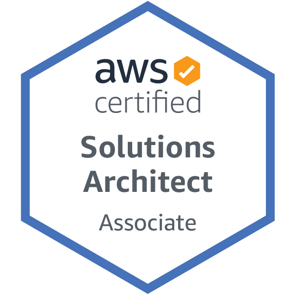

0. 背景
我是工作3年的Java开发，因为工作有在用，所以对AWS有个简单的认识。下面是一些总结：
1. 建议以培训视频为主，AWS官方资料为辅，外加自己操作实践
年初开始准备，开始是在看官方资料，效率非常非常低。
3月开始看培训视频，断断续续花了3个月才看完。
2. 有必要好好刷题
我总共做了5套模拟题，刷题让我知道考试是怎样考，考什么。
把刷题作为学习的检验手段而不是期盼着能刷到考试原题，我好像只做到1道原题，我感觉考试的题目比刷题的更细一点。
做题中如果发现自己对几个相似的服务无法区分，一定要去搞清楚，考试一定考。
3. 考试
我的考试场地是南山的一家培训公司，在一个放了几张桌子几台电脑的小隔间。考试人不多，各种考试的人加起来一天才5个，3个AWS的，1个思科，1个管理类考试。考试网络巨慢，9点开始考，考到1点是正常，主要是每次切题都去call一次海外服务器，200个英文单词不到加载用了1~5分钟，加载题目是不占用时间的。如果加载了10分钟可以尝试叫管理员给你 换电脑 或者 切线路 。
只要你中文还行，建议就选中文考试，选中文考试页面会有下拉框给你选择显示英文题目还是中文题目，这有两个好处：
切换语言也是不计时的，所以可以先看一遍英文的题目和选项，然后切中文，在它加载的过程中思考。
中英双语描述，可以帮助更好地理解题目，后面我在检查的时候感觉至少有5道题就是这么救回来的。
4. 考完就知道是否通过
考完，会继续要你填一个问卷调查，一直点到最后一个页面会告知是否通过，英语的有 pass 字样，中文的有 通过 两个字。
另外我是当天晚上就收到邮件通知，并且能在AWS的认证中心查到信息。这是上面提供下载的一个小图标，感觉也挺好看的哈哈哈。

5. 附录
AWS 的官方资料： 考试指南、白皮书、FAQ、UserGuide
[一位大佬的备考心得](https://www.jianshu.com/p/98e4bcdaea3b)
[挨踢茶馆-模拟题](https://iteablue.com/course/aws-saa-online-quiz/quizzes/saa-quiz-english-1):里面的模拟题和论坛可以看看。