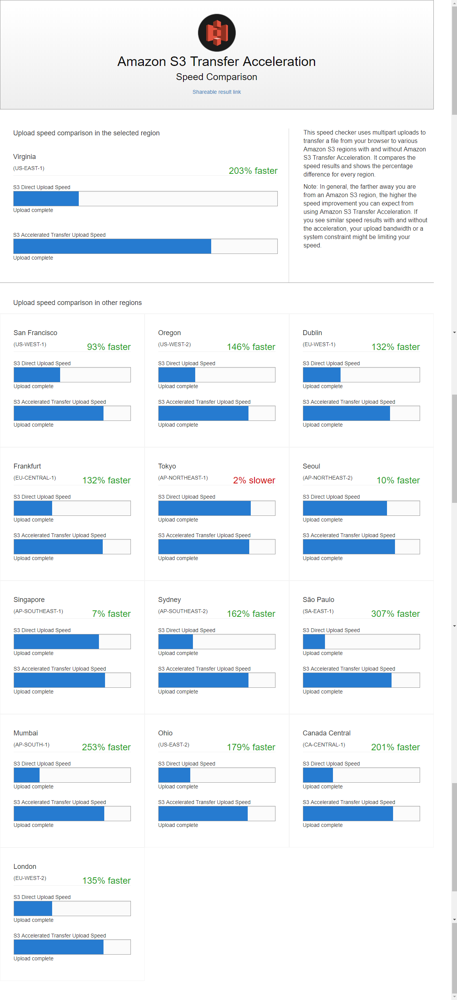

# Best Practices Design Patterns: Optimizing Amazon S3 Performance

2019.06 First publication

## Introduce

* Transaction
3500 PUT/COPY/POST/DELETE and 5500 GET/HEAD requests per second per prefix in a bucket
no limits to the number of prefixes in a bucket
no limits to the number of connections made to your bucket
* Throughput
EC2 <-> S3: max throughput 100G/s per EC2 instance
**Question: depends on EC2 count or network count?**
* Latency: small object or first-byte-out larger object latency of roughly 100~200 ms.
* cache: S3 + CloudFront / ElasticCache
* Long Distance between Client and S3: S3 Transfer Acceleration. Transfer Acceleration uses the globally distributed edge locations in CloudFront to accelerate data transport over geographical distances.

## Performance Guidelines for Amazon S3

### Measure Performance

Network Throughput
CPU
DRAM
DNS lookup time, latency, data transfer speed. Using HTTP analysis tools.

### Scale Storage Connections Horizontally

* Spreading requests across many connections to horizontally scale performance, to maximize the accessible bandwidth from Amazon S3.
* Amazon S3 doesn't have any limits for the number of connections made to your bucket.

### Use Byte-Range Fetches

use concurrent connections to S3 to fetch different byte ranges from within a larger object.
improve retry times when requests are interrupted.
typical sizes for byte-range requests are 8 MB or 16MB
Or if objects are PUT using a multipart upload, use the same part size (or aligned to part boundaries)
GET requests can directly address individual parts. for example, GET ?partNumber=N

### Retry Requests for Latency-Sensitive Applications

* Aggressive timeouts and retries help drive consistent latency
* Given the large scale of Amazon S3, if the first request is slow, a retried request is likely to take a different path and quickly succeed
* The AWS SDKs have configurable timeout and retry values that you can tune to the tolerances of your specific application.

### Combine Amazon S3 (Storage) and Amazon EC2 (Compute) in the Same AWS Region

Although S3 bucket names are globally unique, each bucket is stored in a Region that you select when you create the bucket. To optimize performance, we recommend that you access the bucket from Amazon EC2 instances in the same AWS Region when possible. This helps reduce network latency and data transfer costs.

### Use Amazon S3 Transfer Acceleration to Minimize Latency Caused by Distance

Amazon S3 Transfer Acceleration manages fast, easy, and secure transfers of files over long geographic distances between the client and an S3 bucket. Transfer Acceleration takes advantage of the globally distributed edge locations in Amazon CloudFront. As the data arrives at an edge location, it is routed to Amazon S3 over an optimized network path. Transfer Acceleration is ideal for transferring gigabytes to terabytes of data regularly across continents. It's also useful for clients that upload to a centralized bucket from all over the world.

[Amazon S3 Transfer Acceleration Speed Comparison tool](http://s3-accelerate-speedtest.s3-accelerate.amazonaws.com/en/accelerate-speed-comparsion.html)

To compare accelerated and non-accelerated upload speeds across Amazon S3 Regions. The Speed Comparison tool uses multipart uploads to transfer a file from your browser to various Amazon S3 Regions with and without using Amazon S3 Transfer Acceleration.

### Use the Latest Version of the AWS SDKs

* The AWS SDKs provide built-in support for many of the recommended guidelines for optimizing Amazon S3 performance.
* The SDKs also provide the Transfer Manager, which automates horizontally scaling connections to achieve thousands of requests per second, using byte-range requests where appropriate.

## Performance Design Patterns for Amazon S3

### Using Caching for Frequently Accessed Content

Successful cache adoption can result in low latency and high data transfer rates.
Applications that use caching also send fewer direct requests to Amazon S3, which can help reduce request cost.
Amazon CloudFront: fast content delivery network (CDN) that transparently caches data from Amazon S3 in a large set of geographically distributed points of presence (PoPs). When objects might be accessed from multiple Regions.
Amazon ElasticCache: a managed, in-memory cache. To use ElasticCache, you should modify application logic to both populate the cache with hot objects and check the cache for hot objects before requesting them from Amazon S3.
AWS Elemental MediaStore: a caching and content distribution system specifically built for video workflows and media delivery from Amazon S3. Provides end-to-end storage APIs specifically for video, and is recommended for performance-sensitive video workloads.

### Timeouts and Retries for Latency-Sensitive Applications

If an application generates high request rates (typically sustained rates of over 5,000 requests per second to a small number objects), it might receive HTTP 503 slowdown responses.
AWS SDK implements automatic retry logic using exponential backoff when receiving the HTTP 503 error.
Amazon S3 automatically scales in response to sustained new request rates, dynamically optimizing performance.  You will receive HTTP 503 response until the optimization completes.
For latency-sensitive applications, Amazon S3 advises tracking and aggressively retrying slower operations. When you retry a request, we recommend using a new connection to Amazon S3 and performing a fresh DNS lookup.
When you make large variably sized requests (for example, more than 128 MB), we advise tracking the throughput being achieved and retrying the slowest 5 percent of the requests. When you make smaller requests (for example, less than 512 KB), where median latencies are often in the tens of milliseconds range, a good guideline is to retry a GET or PUT operation after 2 seconds.

### Horizontal Scaling and Request Parallelization for High Throughput

For high-throughput transfers, Amazon S3 advises using applications that use multiple connections to GET or PUT data in parallel. For example, this is supported by Amazon S3 Transfer Manager in the AWS Java SDK, and most of the other AWS SDKs provide similar constructs. For some applications, you can achieve parallel connections by launching multiple requests concurrently in different application threads.
As a general rule, when you download large objects within a Region from Amazon S3 to Amazon EC2, we suggest making concurrent requests for byte ranges of an object at the granularity of 8-16MB. Make one concurrent request for each 85-90 MB/s of desired network throughput.

If your application issues requests directly to Amazon S3 using the REST API, we recommend using a pool of HTTP connections and re-using each connection for a series of requests. Avoiding per-request connection setup removes the need to perform TCP slow-start and Secure Sockets Layer (SSL) handshakes on each request.

Finally, it's worth paying attention to DNS and double-checking that requests are being spread over a wide pool of Amazon S3 IP addresses. DNS queries for Amazon S3 cycle through a large list of IP endpoints. But caching resolvers or application code that reuses a single IP address do not benefit from address diversity and the load balancing that follows from it. Network utility tools such as the *netstat* command line tool can show the IP address being used for communication with Amazon S3, and we provide guidelines for [DNS configuration](https://docs.aws.amazon.com/AmazonS3/latest/dev/DNSConsiderations.html) to use.

### Using Amazon S3 Transfer Acceleration to Accelerate Geographically Disparate Data Transfers

Amazon S3 Transfer Acceleration is effective at minimizing or eliminating the latency caused by geographic distance between globally dispersed clients and a regional application using Amazon S3.
Transfer Acceleration uses the globally distributed edge locations in CloudFront for data transport. The AWS edge network has points of presence in more 50 locations. Today, it is used to distribute content through CloudFront and to provide rapid responses to DNS queries made to Amazon Route 53.
The edge network also helps to accelerate data transfers into and out of Amazon S3. It's ideal for applications that transfer data across or between continents, have a fast internet connection, use large objects, or have a lot of content to upload. As the data arrives at an edge location, data is routed to Amazon S3 over an optimized network path. In general, the farther away you are from an Amazon S3 Region, the higher the speed improvement you can expect from using Transfer Acceleration.
You can set up Transfer Acceleration on new or existing buckets. You can use a separate Amazon S3 Transfer Acceleration endpoint to use the AWS edge locations. use [the tool](http://s3-accelerate-speedtest.s3-accelerate.amazonaws.com/en/accelerate-speed-comparsion.html) to test whether helps client request performance.
 Network configurations and conditions vary from time to time and from location to location. So, you are charged only for transfers where Amazon S3 Transfer Acceleration can potentially improve your upload performance.
 Each time you use S3 Transfer Acceleration to upload an object, we will check whether the service is likely to be faster than a regular Amazon S3 transfer. If we determine that it is not likely to be faster than a regular Amazon S3 transfer of the same object to the same destination AWS Region, we will not charge for that use of S3 Transfer Acceleration for that transfer, and may bypass the S3 Transfer Acceleration system for that upload.[Reference](https://aws.amazon.com/s3/pricing/)

### AbortIncompleteMultipartUpload: delete all parts associated with the incomplete multipart upload
For multipart upload API to upload large objects in parts, you can setup lifecycle configuration to tell Amazon S3 to abort incomplete multipart uploads. When Amazon S3 aborts a multipart upload, it deletes all parts associated with the upload. So you don't have to pay storage costs for them. For example,

```xml
<LifecycleConfiguration>
    <Rule>
        <ID>sample-rule</ID>
        <Prefix>SomeKeyPrefix</Prefix>
        <Status>rule-status</Status>
        <AbortIncompleteMultipartUpload>
           <DaysAfterInitiation>7</DaysAfterInitiation>
        </AbortIncompleteMultipartUpload>
    </Rule>
</LifecycleConfiguration>
```


### Refer

AWS Key Management Service Developer Guide: see AWS KMS Limits about request rates.
[AWS KMS 配额](https://docs.aws.amazon.com/zh_cn/kms/latest/developerguide/limits.html)

HTTP connection pool to access other api